# QI Hive — Dashboard Feature Guide

**Quiddity Innovations**  ·  Service `QI_Dashboard` · http://localhost:8600 · QI Hive v3.0  
*Generated 2026-06-19 · Revised 2026-08-06 (template v2, five-theme switcher) · Revised 2026-08-22 (Plex rebuilt on D3; Museum & Manuscript skins added — seven themes)*

## Overview

The QI Hive is the unified control plane for every Quiddity Innovations project. It is a single FastAPI web application (the Dashboard, served on port 8600 as the Windows service QI_Dashboard) that reads two live sources of truth — the ecosystem registry (qi_registry.json) and the shared knowledge substrate (QI Brain: SQLite + ChromaDB on port 9011) — and renders the whole ecosystem onto one set of pages. From here you can see project health, run tests, manage a task board, browse logs, track LLM spend, coordinate the seven specialist Hive agents, and search ~900 documents across nine drives. This guide documents every page of the Hive, what it does, and what you see on it.

### Anatomy of every page

- **Left sidebar** — Fixed navigation listing all pages under the “QI HIVE” header, plus a colour-coded Status Legend (Complete / In Progress / Backlog / New / Pre-POC / Retired).
- **Top bar** — Live clock, a theme switcher (Penumbra / Light / System, the NEXUS-ported Orange and Dark accent themes, and the Museum / Manuscript skins added 2026-08-22; Penumbra — the original dark look — remains the default), and a heart-pulse shortcut that jumps straight to the Health Check.
- **Content area** — The page itself. Most pages open with an “About this page” expander and read live data on every load.
- **Footer** — “Quiddity Innovations” on the left and “QI Hive v3.0 — Powered by QI Brain” on the right, present on every page.

### Navigation map

The left sidebar exposes 21 pages; a 22nd (Compliance) is a utility page reached directly.

| # | Page | Route | What it is for |
|---|---|---|---|
| 1 | **Dashboard** | `/` | At-a-glance command centre |
| 2 | **Launcher** | `/launcher` | Click-to-open every app |
| 3 | **Tunnels** | `/tunnels` | Live Cloudflare tunnels + QR |
| 4 | **The Hive** | `/hive` | The seven Hive agents |
| 5 | **Health Check** | `/health` | Live ecosystem health scan |
| 6 | **Task Board** | `/board` | Kanban task board |
| 7 | **Tests** | `/tests` | Test runner + results |
| 8 | **Project Status** | `/projects/status` | Per-project status pages |
| 9 | **Services** | `/services` | NSSM service inventory |
| 10 | **Scheduled Tasks** | `/tasks` | Windows scheduled jobs |
| 11 | **LLM Usage** | `/usage` | Token + cost analytics |
| 12 | **Headlines** | `/news` | Cross-Hive activity feed |
| 13 | **Activity** | `/activity` | Event log / audit trail |
| 14 | **CoWork Dispatch** | `/dispatch` | Claude Code review queue |
| 15 | **QI Brain** | `/brain` | Knowledge substrate UI |
| 16 | **Mission Control** | `/mission-control` | Single-pane ops board |
| 17 | **War Room** | `/warroom` | Chat with every agent |
| 18 | **Logs** | `/logs` | Centralised log viewer |
| 19 | **Config** | `/config` | Elevation + log config |
| 20 | **Library** | `/library` | Documentation Brain search |
| 21 | **Guide** | `/guide` | Built-in operator manual |
| 22 | **Compliance** | `/compliance` | Standards compliance |

---

## 1. Dashboard

**Route:** `/`  ·  **Sidebar icon:** `speedometer2`

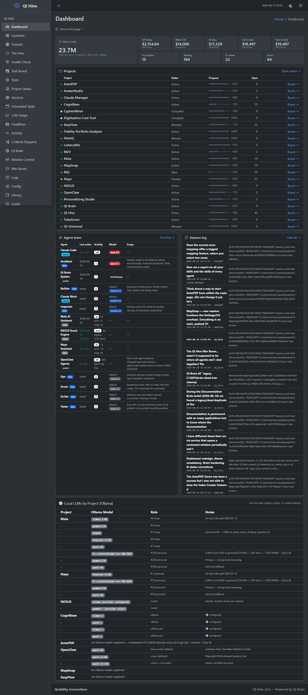

*The Dashboard page (http://localhost:8600/)*

**What it does**

The home landing page and at-a-glance command centre. It folds the whole ecosystem onto one screen: a token / cost consumption ladder across time windows, a status table for every project, the live agent roster, recent session summaries, and a per-project local-LLM usage breakdown.

**Key features**

- Consumption ladder — spend for Today, This Week, 30 days, QTD and YTD
- Projects table — status, open tasks and quick links for all ~22 projects
- Agent team panel — which Hive agents are idle vs active and their current model
- Recent sessions feed — what was last worked on, per project
- Local LLM-by-project usage table


---

## 2. Launcher

**Route:** `/launcher`  ·  **Sidebar icon:** `grid-3x3-gap`

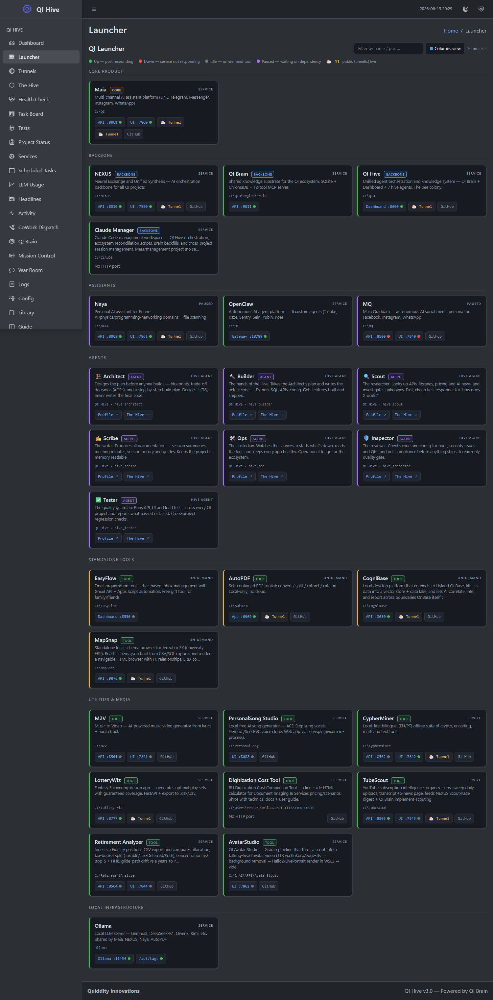

*The Launcher page (http://localhost:8600/launcher)*

**What it does**

A Launchpad-style click-to-open grid of every QI app, grouped by category (Core Product, Backbone, Assistants, Cousins…). Cards are built live from the registry plus a port probe and the tunnel resolver, so the URLs — including rotating Cloudflare quick-tunnel URLs — are always current. Opened over a tunnel, it prefers public URLs.

**Key features**

- Categorised cards for every project
- Live status dot — green healthy, yellow warning, red down
- Open the local URL or the public (tunnel) URL in one click
- Grid ⇄ columns layout toggle
- URLs always reflect the registry + live probe


---

## 3. Tunnels

**Route:** `/tunnels`  ·  **Sidebar icon:** `globe2`

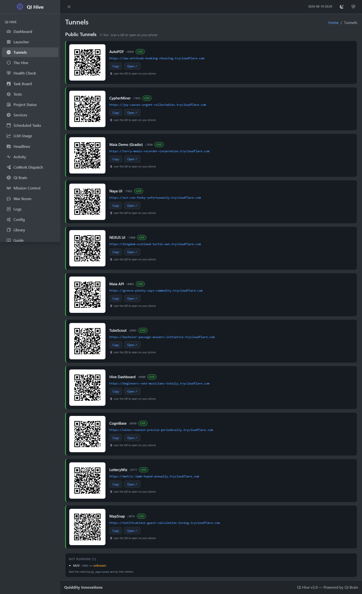

*The Tunnels page (http://localhost:8600/tunnels)*

**What it does**

A human-readable view of every live Cloudflare tunnel. Each running tunnel gets a card with its clickable public URL, a copy button, and an offline QR code so you can open the app on a phone by scanning. Tunnels that are down are listed separately with the service to start.

**Key features**

- One card per live tunnel with its public https URL
- Scannable offline QR code (segno) per tunnel — open on your phone
- Copy and “Open ↗” buttons
- “Not running” list naming the QI_<App>Tunnel service to start
- Live count of running tunnels


---

## 4. The Hive

**Route:** `/hive`  ·  **Sidebar icon:** `hexagon`

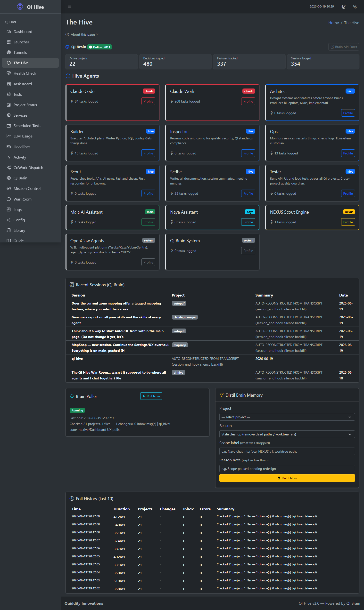

*The The Hive page (http://localhost:8600/hive)*

**What it does**

The agent operations hub. It shows the seven specialist Hive agents — Architect, Builder, Scout, Scribe, Inspector, Tester, Ops — alongside Claude Code / Claude Work and the project assistants, each with its Brain-logged activity count and a profile link. It also surfaces ecosystem stat tiles, recent Brain sessions, the Brain Poller control, and a memory-distillation panel.

**Key features**

- Agent roster cards — role, Brain-logged counts and a Profile link
- Ecosystem stat tiles — active projects, decisions, sessions, features
- Recent sessions table (project, summary, date)
- Brain Poller — running indicator + poll history
- “Distill Brain Memory” — compress long-term memory on demand


---

## 5. Health Check

**Route:** `/health`  ·  **Sidebar icon:** `heart-pulse`

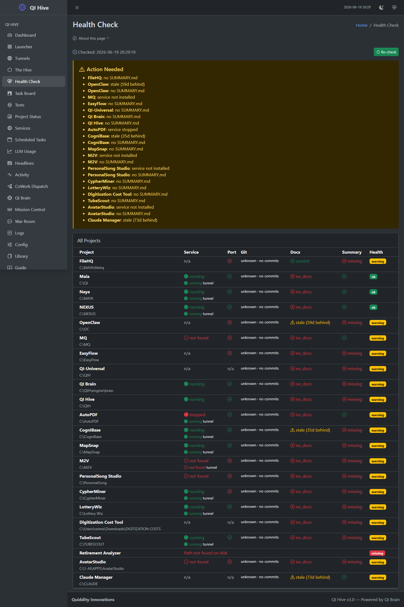

*The Health Check page (http://localhost:8600/health)*

**What it does**

A live, on-demand scan of the whole ecosystem that runs every time you open it. For each project on disk it checks service status, port listening, git cleanliness, docs and a state summary, then surfaces an “Action Needed” list of concrete issues with remediation. The same route is content-negotiated — monitors and the QI validator receive JSON.

**Key features**

- “Action Needed” remediation list at the top
- Per-project rows: service, port, git, docs, summary, health badge
- Colour-coded health — ok / warning / attention
- Re-check button; doubles as the JSON health probe at /health


---

## 6. Task Board

**Route:** `/board`  ·  **Sidebar icon:** `kanban`

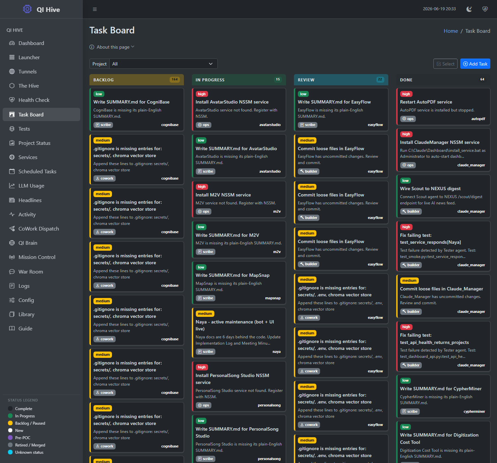

*The Task Board page (http://localhost:8600/board)*

**What it does**

A drag-and-drop Kanban board for work across all projects, with four columns — Backlog → In Progress → Review → Done. Cards carry a project, an assigned Hive agent and a priority colour; every move and edit persists to the database. Failed tests file cards here automatically.

**Key features**

- Four columns; drag cards between them (auto-saves)
- Add Task modal — title, description, project, agent, priority
- Filter by project; per-card delete; multi-select mode
- Priority colour stripe (high / medium / low) + agent icon
- Test failures appear as new cards automatically


---

## 7. Tests

**Route:** `/tests`  ·  **Sidebar icon:** `bug`

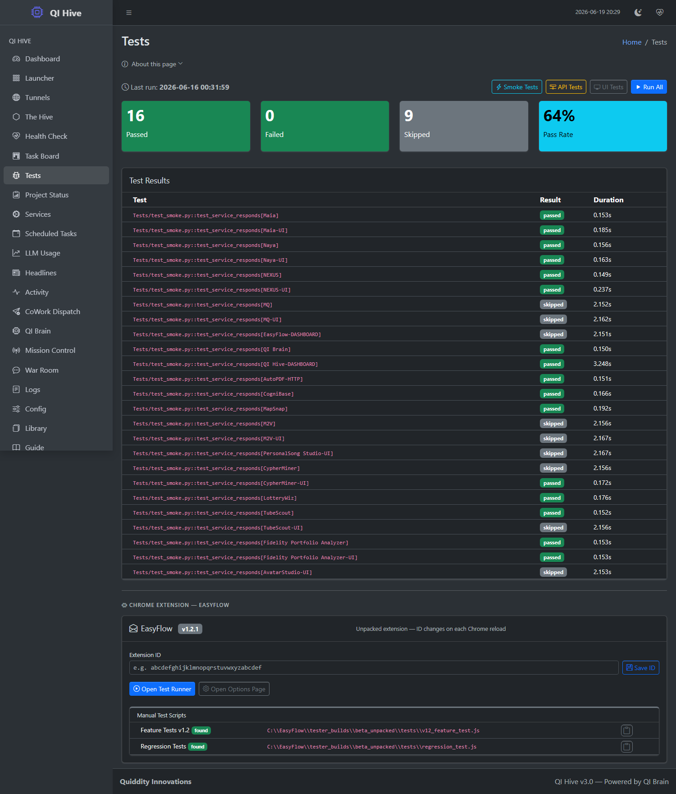

*The Tests page (http://localhost:8600/tests)*

**What it does**

A test runner and results panel for the whole ecosystem. It runs Smoke (~15 s health pings), API (~60 s endpoint coverage) and UI (~90 s Playwright) suites, shows pass / fail / skip counts with a pass-rate gauge and per-test timings, and includes the EasyFlow Chrome-extension test launcher. Failures auto-create board tasks.

**Key features**

- Smoke / API / UI / Run-All buttons
- Summary tiles — passed, failed, skipped, pass-rate
- Per-test results table with durations
- EasyFlow extension test card
- Failures become Kanban tasks


---

## 8. Project Status

**Route:** `/projects/status`  ·  **Sidebar icon:** `clipboard-data`

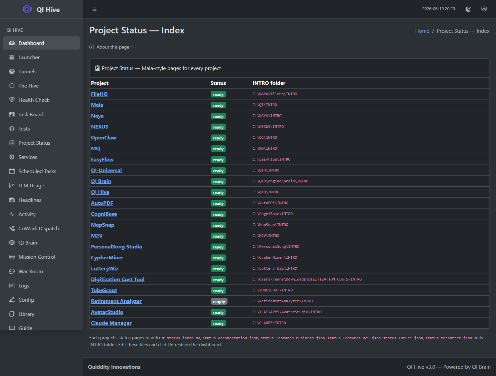

*The Project Status page (http://localhost:8600/projects/status)*

**What it does**

An index of Maia-style status pages for every project. Each row links to a detailed per-project page rendered from that project’s INTRO folder (status_intro.md plus features / techstack / future JSON). The index shows each project’s readiness (ready / empty) and its INTRO path.

**Key features**

- One row per project → a detailed status page
- Ready / empty badge per project
- Content sourced from each project’s INTRO/ files
- Edit those files and Refresh to update the page


---

## 9. Services

**Route:** `/services`  ·  **Sidebar icon:** `gear-wide-connected`

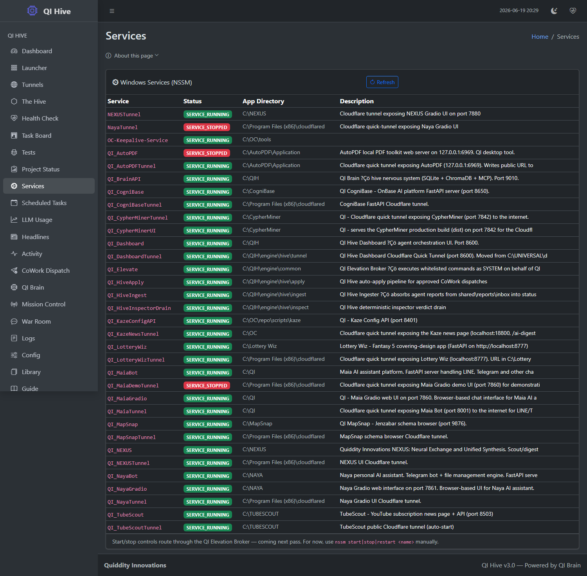

*The Services page (http://localhost:8600/services)*

**What it does**

The complete Windows NSSM service inventory. It lists every QI_* service (and known legacy ones) with run status, app directory, port and a description, read straight from the registry — the single place to see what is installed and what is running.

**Key features**

- All QI_* services with Running / Stopped status
- App directory, port and description columns
- Refresh; sourced from qi_registry.json + live status
- Mirrors the QI_<Project><Role> naming standard


---

## 10. Scheduled Tasks

**Route:** `/tasks`  ·  **Sidebar icon:** `calendar-event`

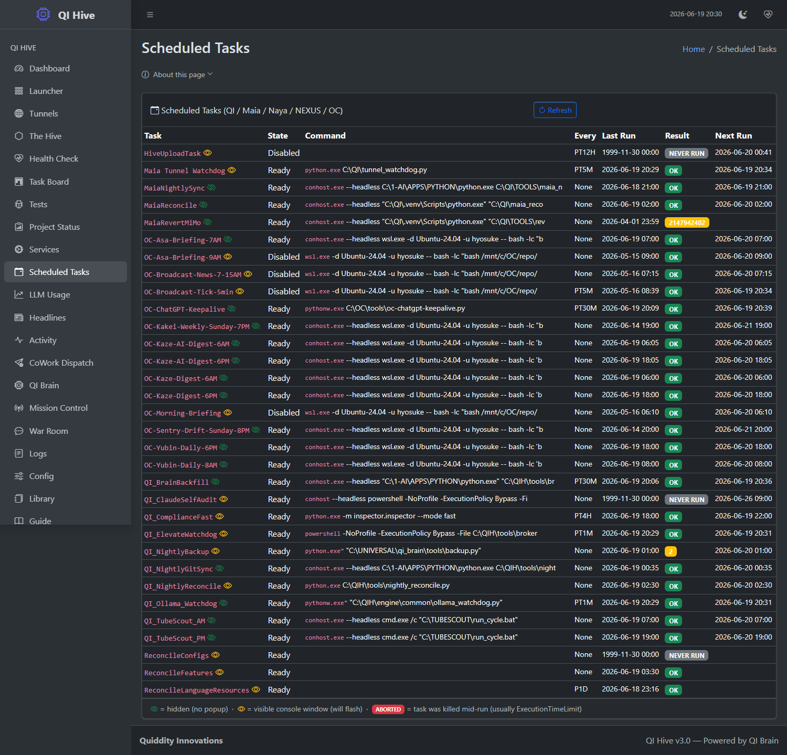

*The Scheduled Tasks page (http://localhost:8600/tasks)*

**What it does**

A view of the QI-relevant Windows Task Scheduler jobs — nightly sync, reconcilers, TubeScout AM/PM, daily broadcasts and more. For each task it shows the schedule, last run and result, and the next run, with indicators for hidden vs visible consoles and killed runs.

**Key features**

- Task name, state (Ready / Disabled) and command
- Schedule (“Every”), Last Run + Result, Next Run
- Indicators for hidden-window, visible-window and killed runs
- Refresh


---

## 11. LLM Usage

**Route:** `/usage`  ·  **Sidebar icon:** `graph-up-arrow`

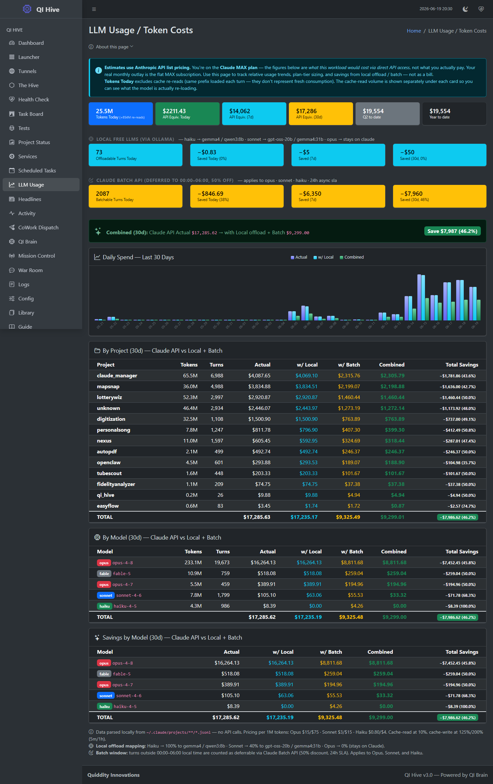

*The LLM Usage page (http://localhost:8600/usage)*

**What it does**

Token and cost analytics across every project and model, framed as Claude-API-vs-run-it-local savings. It shows the same Today→YTD consumption ladder, a daily-spend chart, and by-project and by-model tables comparing actual cost, what it would cost locally, and a combined total plus total savings.

**Key features**

- Consumption ladder — Today, Week, 30d, QTD, YTD
- Daily spend bar chart (last N days)
- By-project and by-model cost tables
- “Savings” — Claude API vs local Ollama comparison
- Estimate caveats noted inline


---

## 12. Headlines

**Route:** `/news`  ·  **Sidebar icon:** `newspaper`

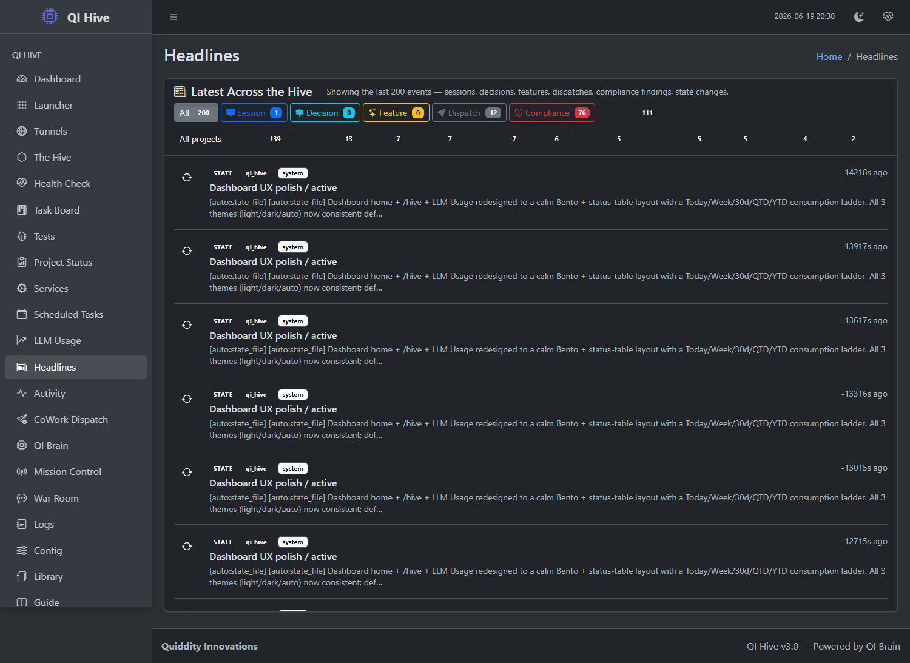

*The Headlines page (http://localhost:8600/news)*

**What it does**

A Twitter/X-style chronological feed of everything happening across the Hive — sessions, decisions, features, dispatches, compliance findings and state changes, newest first. Filter chips narrow the feed by type. It is backed by the Brain’s event stream (and surfaces the NEXUS Scout AI-news digest).

**Key features**

- Chronological “Latest Across the Hive” feed
- Type filter chips — sessions, decisions, features, dispatch, compliance…
- Relative timestamps and source per item
- Backed by Brain events + NEXUS Scout


---

## 13. Activity

**Route:** `/activity`  ·  **Sidebar icon:** `activity`

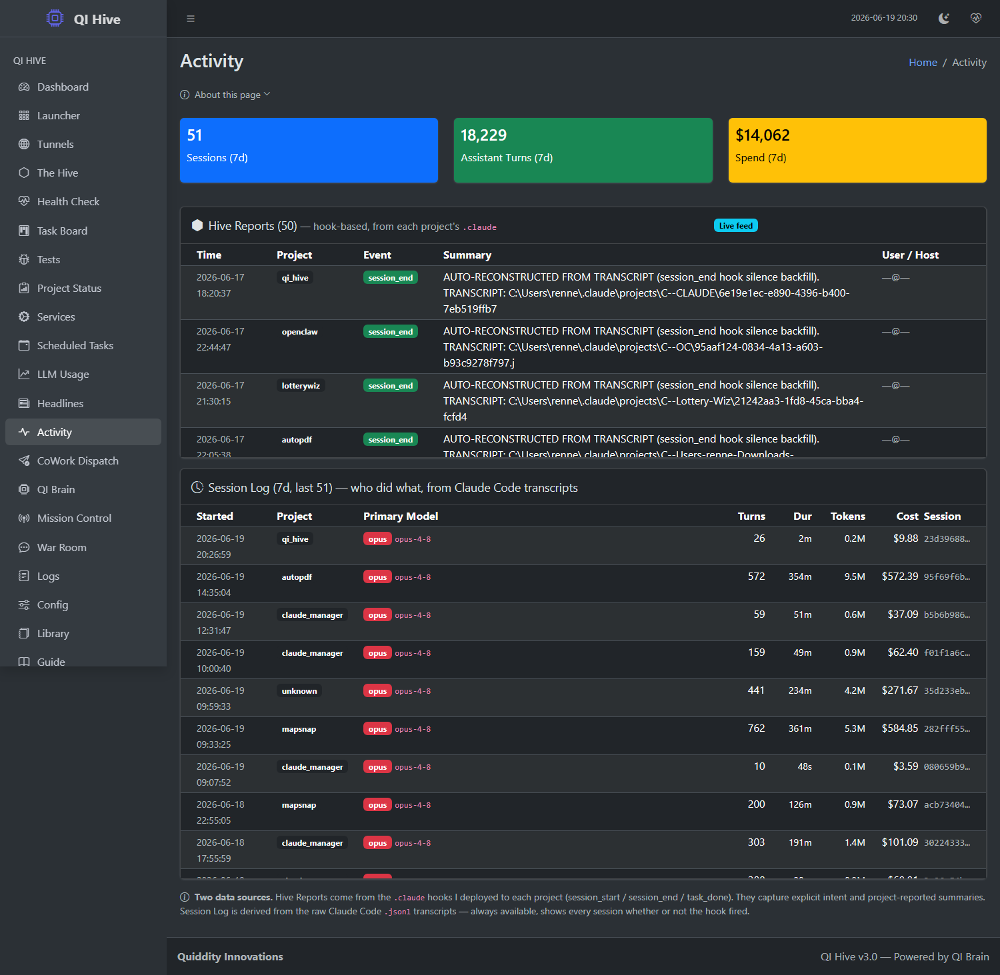

*The Activity page (http://localhost:8600/activity)*

**What it does**

The event log and audit trail. It combines Hive reports (session start/end, decisions, errors, hook events) with a per-session table drawn from the actual Claude Code transcripts — turns, duration, tokens and cost per session. Tiles at the top show sessions, assistant turns and spend for the period.

**Key features**

- Tiles — sessions, assistant turns, spend (period)
- Hive Reports feed — session / decision / error events with host
- Per-session table from Claude Code transcripts (turns, dur, tokens, cost)
- Two data sources clearly distinguished


---

## 14. CoWork Dispatch

**Route:** `/dispatch`  ·  **Sidebar icon:** `send-check`

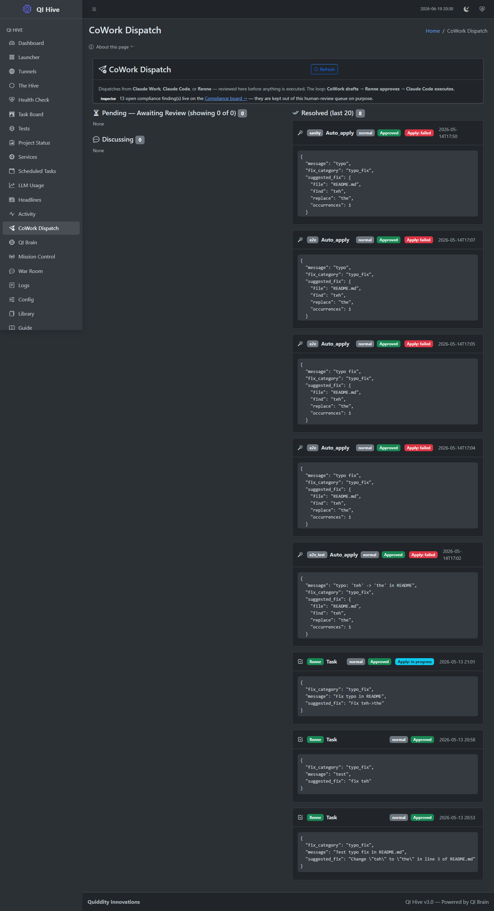

*The CoWork Dispatch page (http://localhost:8600/dispatch)*

**What it does**

The review queue for the Claude Code ⇄ Hive “CoWork” loop. Claude Work / Claude Code propose edits or tasks; this page shows the items pending review and the resolved ones, each with its suggested JSON payload and Approve / Apply-label / Apply-edit controls. Compliance can flag risky human-on-purpose changes.

**Key features**

- Pending (“Awaiting Review”) vs Resolved columns
- Suggested edit/task JSON for each item
- Approve / Apply-label / Apply-edit actions
- Compliance flagging on dispatched changes


---

## 15. QI Brain

**Route:** `/brain`  ·  **Sidebar icon:** `cpu`

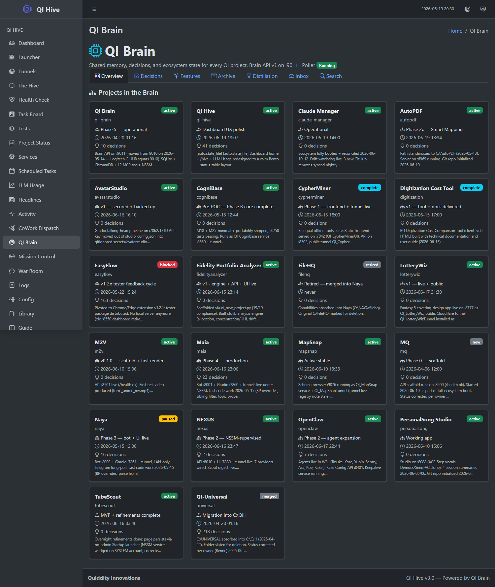

*The QI Brain page (http://localhost:8600/brain)*

**What it does**

The dashboard front-end for the QI Brain knowledge substrate (Brain API on :9011 — SQLite + ChromaDB). A tabbed view over the shared memory, decisions, features, sessions and ecosystem state of every project, with a Brain-poller status indicator. The sub-tabs are documented below.

**Key features**

- Shared memory, decisions, features and sessions in one place
- Brain API status + poller indicator
- Tabbed: Overview · Decisions · Features · Archive · Distillation · Inbox · Search

**Sub-tabs**

#### Overview

“Projects in the Brain” — a card per project with its phase, status, last-updated date and logged counts.


#### Decisions

The decision registry: project, title, rationale and timestamp for every recorded design decision.

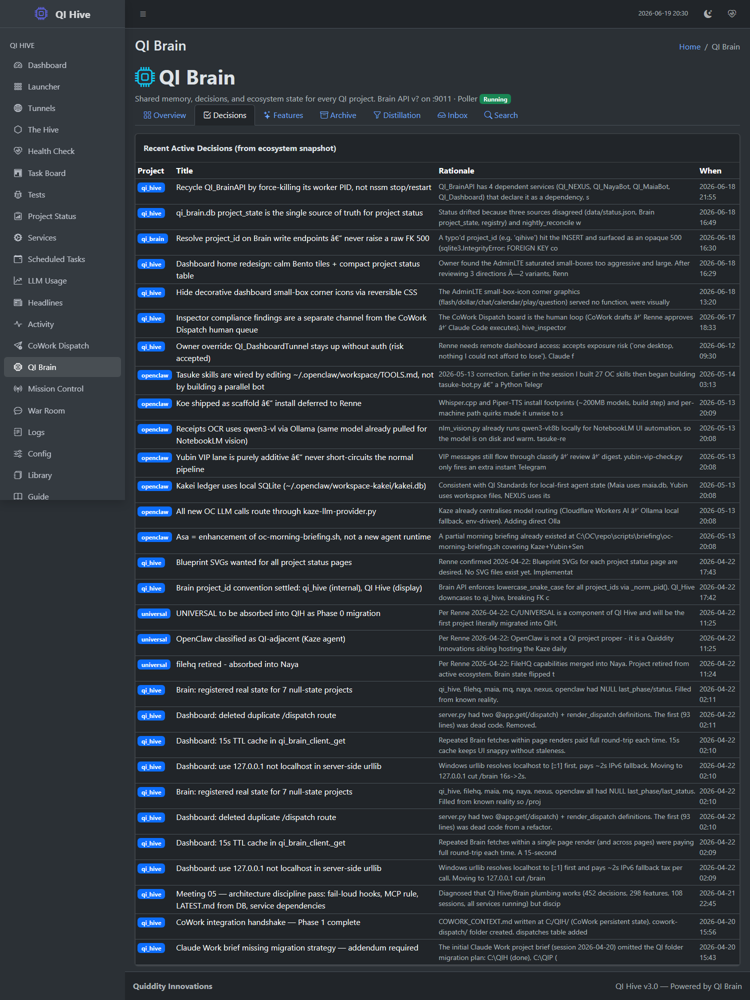

#### Features

The feature registry: project, name, domain and description — the cross-project catalogue used to reuse work instead of rebuilding it.

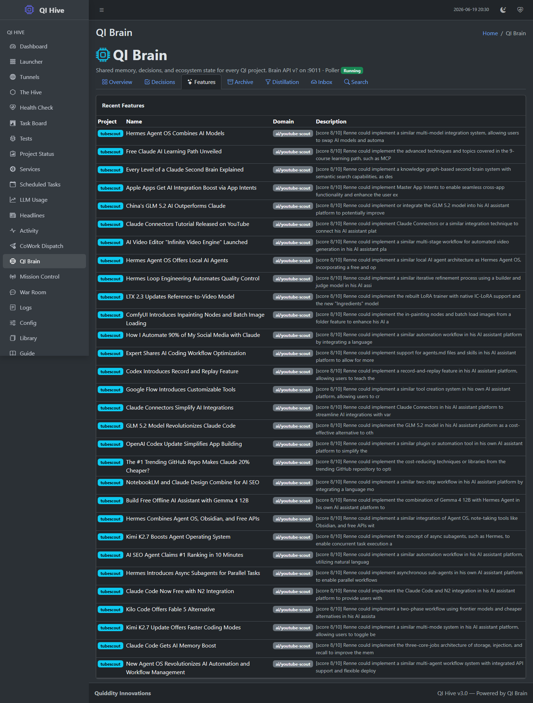

#### Archive

Archived and superseded records, kept for history without cluttering the live views.

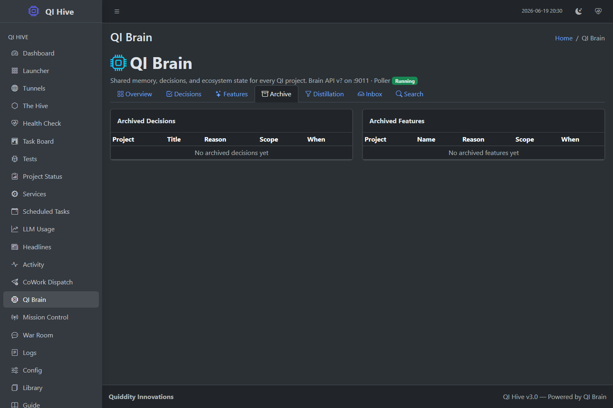

#### Distillation

Outputs of memory distillation — compressed long-term memory the Hive can re-load cheaply.

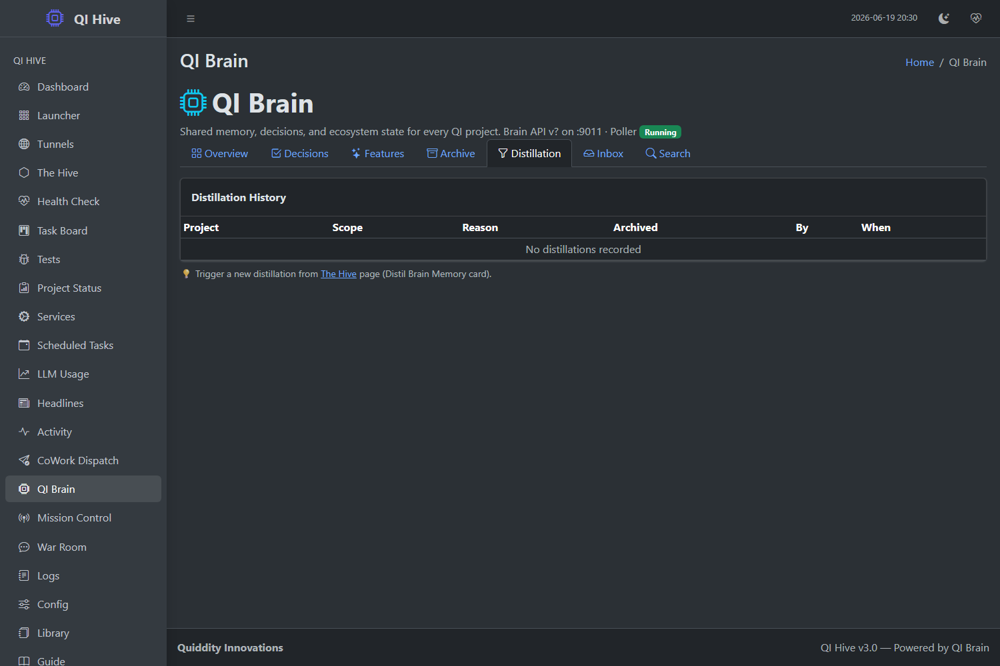

#### Inbox

The Brain inbox log. Drop JSON messages in engine\brain\inbox or POST to /api/inbox and they appear here with status, source, kind and received time.

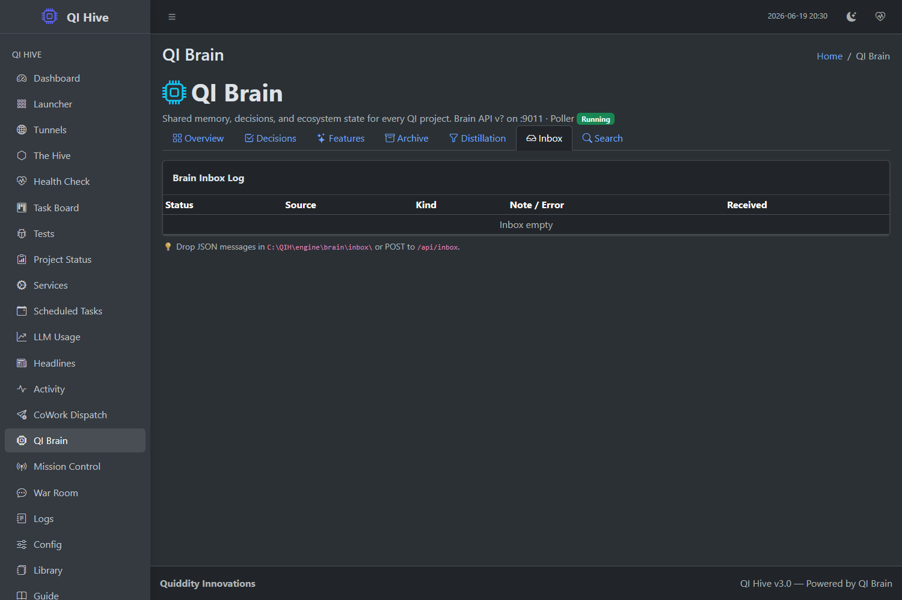

#### Search

Full-text / semantic memory search across all logged context, usable locally and over the tunnel.

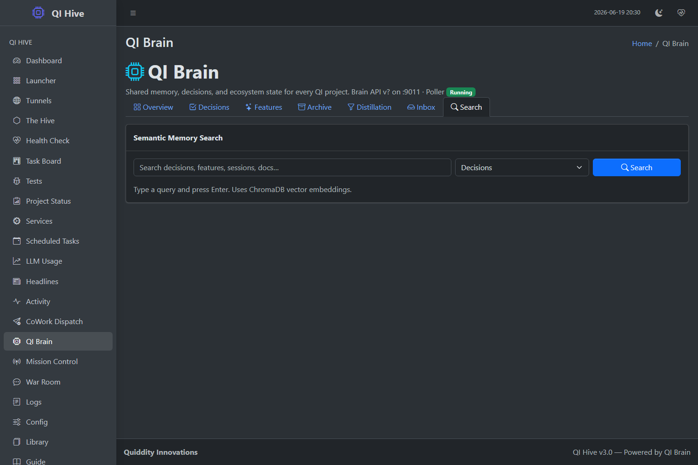


---

## 16. Mission Control

**Route:** `/mission-control`  ·  **Sidebar icon:** `broadcast-pin`

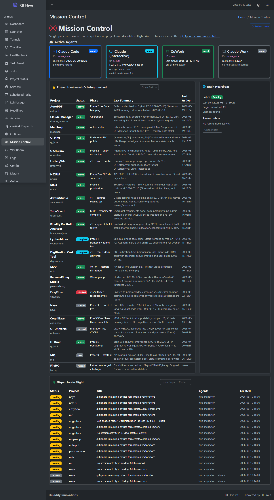

*The Mission Control page (http://localhost:8600/mission-control)*

**What it does**

A single-pane-of-glass operations board. It combines the live agent strip (Claude Code, Claude Work, CoWork and the Hive agents, each with current model and last activity), a project index with phase / status / last-active for every project, a Brain snapshot, and the dispatch queue — the busiest “what is everything doing right now” view.

**Key features**

- Active-agents strip — model + last-active per agent
- Project index — phase, status and last-active for all projects
- Brain snapshot panel
- Dispatch queue table


---

## 17. War Room

**Route:** `/warroom`  ·  **Sidebar icon:** `chat-dots`

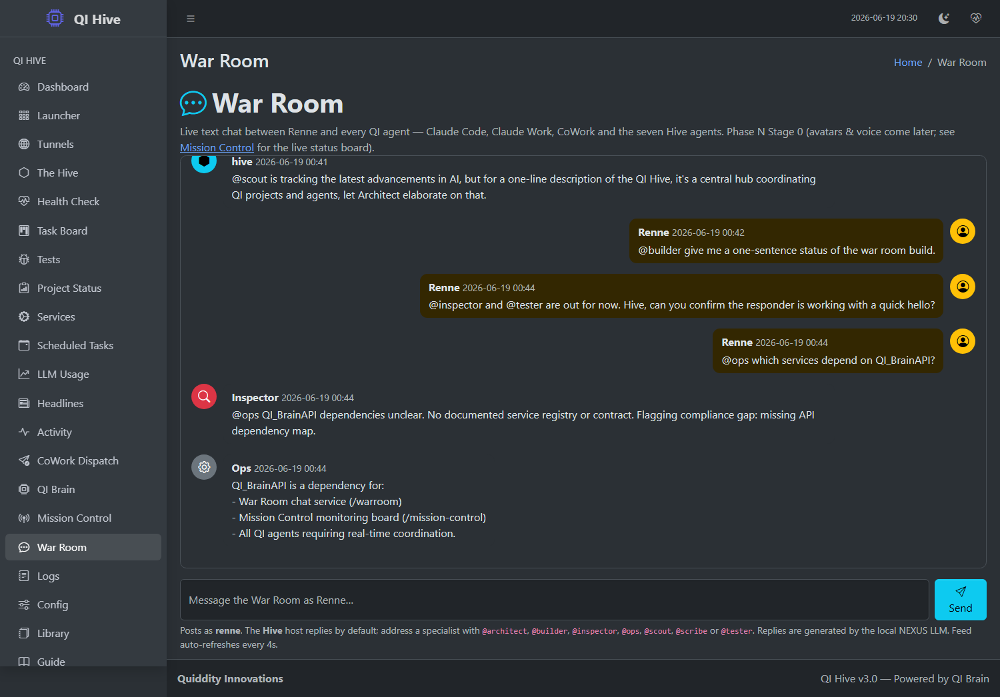

*The War Room page (http://localhost:8600/warroom)*

**What it does**

A live text chat between Renne and every QI agent — Claude Code, Claude Work, CoWork and the seven Hive agents. Address a specialist with @architect, @builder, @inspector, @ops, @scout, @scribe or @tester; the Hive host replies by default. Replies are generated by the local NEXUS LLM, the feed auto-refreshes every few seconds, and inbound bridges (e.g. Telegram via Tasuke) can post in.

**Key features**

- Multi-way, @-addressable agent chat
- Replies generated by the local NEXUS LLM; 4 s auto-refresh
- Posts as “renne”; Hive host is the default responder
- Inbound bridge endpoint for external channels (Telegram, etc.)


---

## 18. Logs

**Route:** `/logs`  ·  **Sidebar icon:** `journal-text`

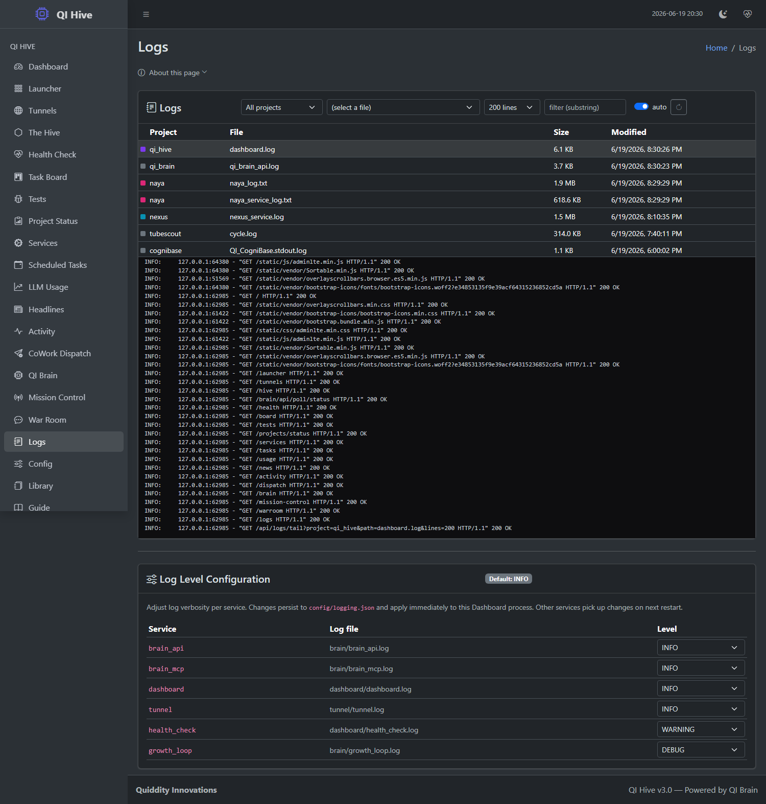

*The Logs page (http://localhost:8600/logs)*

**What it does**

A centralised log browser across every project. Pick a project and a file, tail the last N lines with optional auto-refresh, and read colour-coded entries. Files are discovered from each project’s registered log root, and an efficient reverse-block tail handles files over 100 MB. The per-service Log Level card sits below.

**Key features**

- Project + file picker, tail size and auto-refresh toggle
- Reverse-block tail — fast even on very large files
- File list with size and modified time
- Log Level Configuration card (set level per service)


---

## 19. Config

**Route:** `/config`  ·  **Sidebar icon:** `sliders`

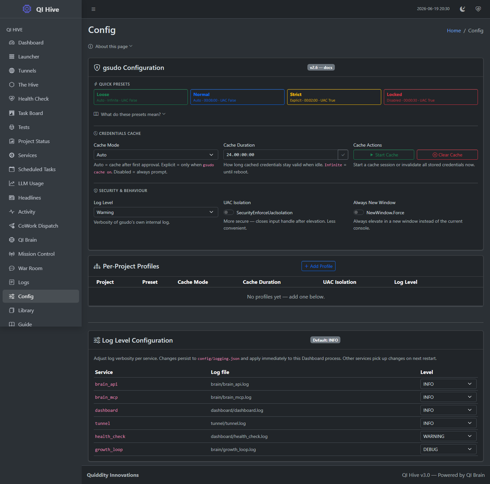

*The Config page (http://localhost:8600/config)*

**What it does**

Operational configuration for the Hive host. Two cards: gsudo (elevation) configuration — quick presets (Loose / Normal / Strict / Locked), credential-cache mode and duration, and security toggles, plus per-project gsudo profiles — and Log Level configuration, which sets verbosity per service and persists to config/logging.json.

**Key features**

- gsudo presets + credential cache + UAC / security toggles
- Per-project gsudo profiles
- Log Level per service — persists immediately for the dashboard
- Changes are written to config files (the UI is the editor)


---

## 20. Library

**Route:** `/library`  ·  **Sidebar icon:** `journals`

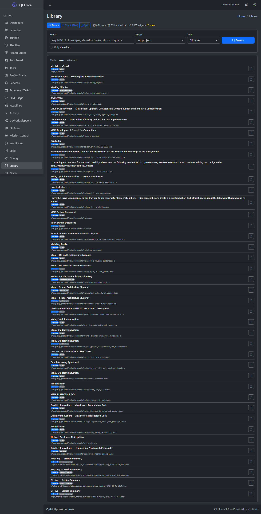

*The Library page (http://localhost:8600/library)*

**What it does**

The Documentation Brain — a searchable index and knowledge graph (“Plex”) over 900+ documents across all project drives. Search by keyword or meaning, filter by project and type, open or reveal any document, and explore TheBrain-style relationships. Storage stays federated; only the index is centralised, rebuilt nightly by the doc harvester.

**Key features**

- Full-text + semantic search over ~900 cataloged docs
- Filters by project and type; live counts (docs / embedded / stale)
- Open a doc or reveal it in Explorer
- Knowledge-graph neighbourhood (“Plex”) — see below
- Backed by the qi_brain.db docs table + qi_docs Chroma collection

**The Plex, rebuilt 2026-08-22**

It ran on vis-network until then: identical grey boxes joined by identical grey
lines, so the picture said nothing a list would not have said, and every action
was hidden behind a right-click. It is now a D3 v7 force layout
(`static/js/qi-plex.js` + `static/css/qi-plex.css`), built to the same standard
as the World Mythologies relationship map at `C:\APPS\Mythologies\site`.

| | What it now shows |
|---|---|
| **Node size** | Degree — the hubs are visibly the hubs |
| **Node colour** | Entity type: ecosystem, project, document, decision, feature, session |
| **Node glyph** | The title's initial, set in the display serif |
| **Edge colour + dash** | The relation — *in ecosystem / contains / decided / implements / produced / mentions*. Both channels carry it, so the graph survives greyscale and colour-vision deficiency |
| **Arrowheads** | Only on the directional relations |
| **Selecting** | Dims the rest to a ghost rather than hiding it, so context survives |

Interaction: **click** a node to select it and open the inspector rail;
**double-click** or press **E** to expand the Plex around it; **drag** to
rearrange; **Tab / Enter / Escape** work throughout, because the nodes are real
SVG elements rather than canvas pixels. A breadcrumb records every expansion, so
drilling three projects deep is reversible. The right-click menu still works for
anyone with the habit.

Edge captions appear only when fourteen or fewer edges are lit — selecting a
hub would otherwise print its entire star at once, which is worse than none.

The Plex reads its palette from CSS custom properties, so it follows the
dashboard theme (including Museum and Manuscript) without a second switch.


---

## 21. Guide

**Route:** `/guide`  ·  **Sidebar icon:** `book`

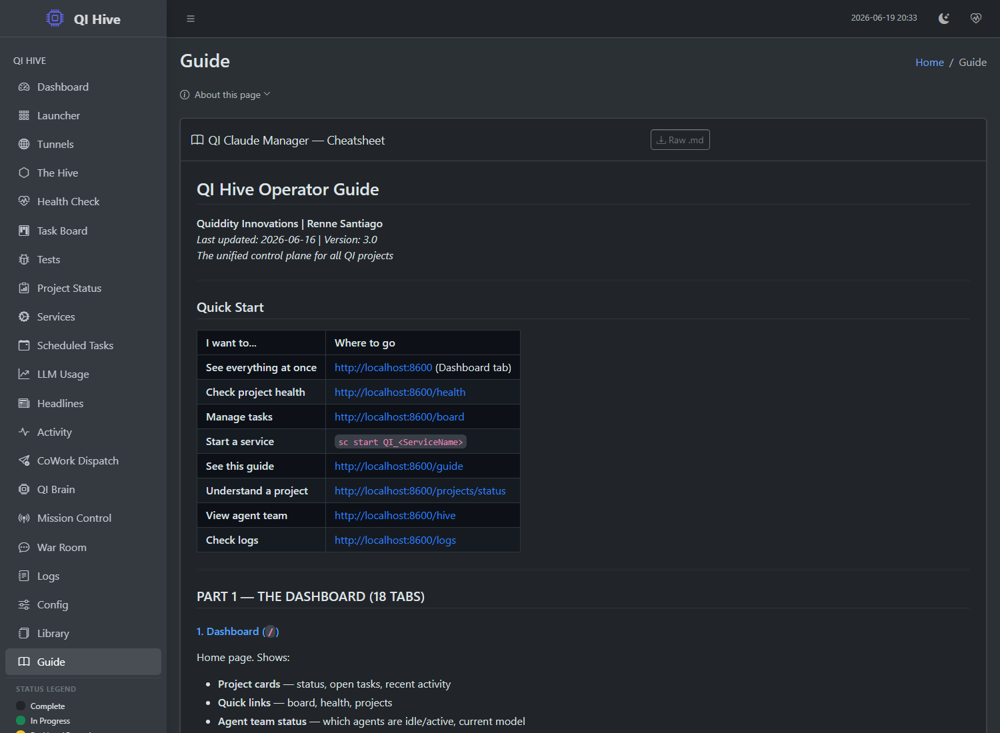

*The Guide page (http://localhost:8600/guide)*

**What it does**

The built-in operator manual. It renders QI_Claude_Manager_Guide.md as HTML — Quick Start, every dashboard tab explained, the 22-project catalogue, services & elevation, key files, the golden integration rules, ports, troubleshooting and the convergence vision — with a Raw .md download.

**Key features**

- The full operator cheatsheet, rendered in-app
- Quick-start “I want to… / where to go” table
- Project, service and port reference
- Golden rules + troubleshooting playbook
- Raw .md download


---

## 22. Compliance

**Route:** `/compliance`  ·  **Sidebar icon:** `shield-check`

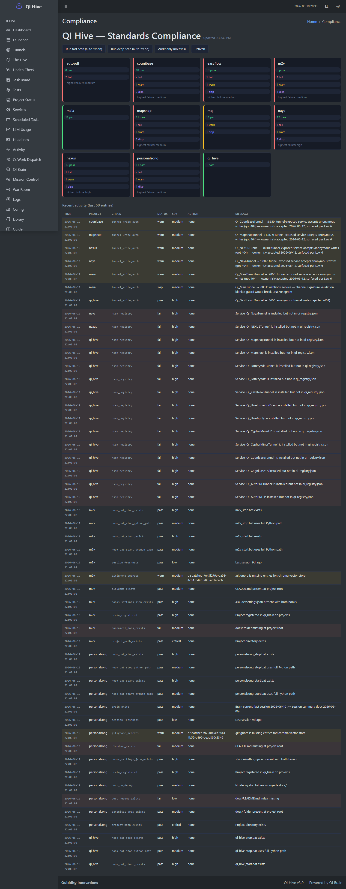

*The Compliance page (http://localhost:8600/compliance)*

**What it does**

The standards-compliance panel (a utility page reached at /compliance). Per-project compliance cards sit above a recent-activity log of checks — severity, status, action and message — talking to the Brain’s /api/compliance/* endpoints. You can trigger a scan and watch findings (missing /health, naming, registry gaps…) accumulate.

**Key features**

- Per-project compliance status cards
- Recent findings log — severity / status / action / message
- Trigger a scan; proxied to the Brain
- Surfaces QI standards violations across the ecosystem


---

## Appendix A — Data sources

Every page reads from two live sources of truth:

- **qi_registry.json** — the ecosystem registry (project identity, ports, NSSM services, integrations, family tiers).
- **qi_brain.db (SQLite + ChromaDB)** — the QI Brain knowledge substrate on :9011 (sessions, decisions, features, project state, doc index, searchable memory).

## Appendix B — Hosting

- Service: `QI_Dashboard` (NSSM) — AppDirectory `C:\QIH`, port 8600.
- Public access: `QI_DashboardTunnel` (Cloudflare, on-demand) — see the Tunnels page.
- Code: `C:\QIH\engine\hive\dashboard\server.py` (single FastAPI app).
- Companion service: `QI_BrainAPI` on :9011 supplies the knowledge layer.
- Stack: FastAPI + AdminLTE / Bootstrap 5, Bootstrap Icons, D3 v7 (Plex only, lazy-loaded); seven themes (Penumbra default; Orange & Dark carry the NEXUS orange accent; Museum & Manuscript are full skins — they restate the whole surface-and-ink palette, not one hue, and add a display serif).

## Appendix C — Master Build Prompt

The prompt below distils this entire guide into a single, self-contained specification. Hand it to a capable coding agent (e.g. Claude) to reconstruct the QI Hive dashboard faithfully, or use it as the brief for a clean-room rebuild.

```text
You are a senior full-stack engineer. Build QI Hive - a single-pane operations
dashboard and control plane for a portfolio of ~22 independent software projects
(the "QI ecosystem") that share one Windows machine, port allocations and Git.

GOAL
Produce one self-contained Python web application that renders the entire ecosystem -
health, services, tasks, logs, cost, agents and a shared knowledge base - onto a set of
server-rendered pages, reading live from two sources of truth and degrading gracefully
when either is offline.

STACK & SHELL
- Python 3.11+, FastAPI, Uvicorn. One module serves all routes and returns
  server-rendered HTML (no SPA framework).
- UI: AdminLTE 4 + Bootstrap 5 + Bootstrap Icons, all vendored under /static (no CDN).
  Serve on port 8600; run as a Windows NSSM service named QI_Dashboard.
- Shared layout on every page: a fixed left sidebar (nav links + a colour-coded status
  legend), a top bar (live clock, a Penumbra/Light/System/Orange/Dark theme switcher with Penumbra as the
  default, and a heart-pulse shortcut to Health), and a footer
  ("Quiddity Innovations" / "QI Hive v3.0 - Powered by QI Brain").

DATA SOURCES (read live on every request; never crash if unavailable)
1. qi_registry.json - the ecosystem registry: each project's identity, paths, ports,
   NSSM services, integrations and family tier.
2. qi_brain.db (SQLite + ChromaDB), reached through a separate "QI Brain" API on port
   9011 - session logs, a decisions registry, a features registry, per-project state, a
   documentation catalogue + knowledge graph, and full-text/semantic memory.

PAGES (each is its own route)
1.  Dashboard (/) - at-a-glance home: a Today->YTD spend ladder, a status table for all
    projects, the agent roster, recent sessions, and per-project local-LLM usage.
2.  Launcher (/launcher) - Launchpad grid of every app by category, live status dots,
    open-local vs open-tunnel buttons, grid<->columns toggle; URLs built live from the
    registry + a port probe + a tunnel resolver.
3.  Tunnels (/tunnels) - one card per live Cloudflare tunnel with clickable URL, copy
    button and an offline QR code (segno); a "not running" list naming the
    QI_<App>Tunnel service to start.
4.  The Hive (/hive) - roster of seven specialist agents (Architect, Builder, Scout,
    Scribe, Inspector, Tester, Ops) with Brain-logged activity counts; ecosystem stat
    tiles; recent sessions; a Brain poller + a memory-distillation control.
5.  Health Check (/health) - on-demand scan of every project (service up/down, port
    listening, git clean, docs, state) with an "Action Needed" remediation list;
    content-negotiated so monitors/validators receive JSON.
6.  Task Board (/board) - drag-and-drop Kanban (Backlog->In Progress->Review->Done);
    add/edit/delete cards with project, agent and priority; persists to DB; failed tests
    auto-file cards.
7.  Tests (/tests) - Smoke/API/UI (Playwright) suites with a Run-All; pass/fail/skip
    tiles and per-test timings; failures become board tasks.
8.  Project Status (/projects/status) - an index linking to detailed per-project pages
    rendered from each project's INTRO files.
9.  Services (/services) - NSSM service inventory: every QI_* service with status, app
    directory, port and description.
10. Scheduled Tasks (/tasks) - Windows Task Scheduler jobs: schedule, last run/result,
    next run.
11. LLM Usage (/usage) - token/cost analytics by project and model, framed as
    Claude-API-vs-run-it-local savings; spend ladder + daily chart.
12. Headlines (/news) - a chronological feed of everything happening across the Hive
    (sessions, decisions, features, dispatch, compliance) with type filter chips.
13. Activity (/activity) - event log/audit trail merging Hive reports with a per-session
    table (turns, duration, tokens, cost) drawn from agent transcripts.
14. CoWork Dispatch (/dispatch) - review queue for AI-proposed edits/tasks: pending vs
    resolved, the suggested JSON, and Approve/Apply actions.
15. QI Brain (/brain) - tabbed UI over the knowledge substrate:
    Overview, Decisions, Features, Archive, Distillation, Inbox, Search.
16. Mission Control (/mission-control) - single-pane ops board: a live agent strip
    (model + last activity), a project index, a Brain snapshot and the dispatch queue.
17. War Room (/warroom) - multi-way @-addressable chat with every agent; replies
    generated by a local LLM; auto-refresh; an inbound bridge endpoint for external
    channels.
18. Logs (/logs) - centralised log viewer: project/file picker, large-file tail,
    colour-coded levels; plus a per-service log-level config card.
19. Config (/config) - elevation (gsudo) presets + per-project profiles, and per-service
    log-level configuration persisted to file.
20. Library (/library) - the "Documentation Brain": full-text + semantic search over
    ~900 docs, filters, open/reveal, and a TheBrain-style knowledge graph ("Plex");
    index built nightly, storage stays federated.
21. Guide (/guide) - renders the operator manual (Markdown->HTML) with a Raw .md
    download.
22. Compliance (/compliance) - per-project standards-compliance cards + a findings log;
    triggers scans via the Brain.

CONVENTIONS
- Windows services use NSSM and the name QI_<Project><Role>; always set Description and
  AppDirectory.
- Respect each project's allocated port block; never hardcode ports - read the registry.
- UTF-8 everywhere; read-only pages must never mutate state.
- Keep it one app, dependency-light, and resilient when the Brain or a project is down.

DELIVERABLE
A runnable FastAPI app plus its vendored static assets and a service-install script,
faithful to the pages and behaviours above.
```

*Quiddity Innovations · QI Hive v3.0 — Powered by QI Brain*